# Lab_containers
## Цель работы: 
Сравнить рукописные и STL контейнеры, определить асимптотику работы различных методов, чтобы понять когда лучше использовать ту или иную структуру данных.

## 0. Capacity and size of vector
В данном пункте был использован пример с лекции. Рассматривается зависимость capacity и size от номера итерации i, который показывает, сколько элементов уже добавили в изначально пустой вектор.
### With reserve
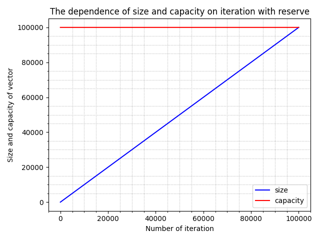

Видно, что с reserve выделяется строго заданное количество памяти.
### Without reserve
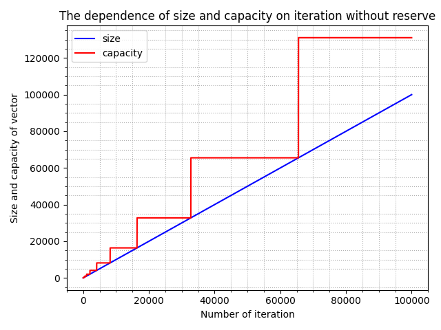

Бeз использования reserve capacity, то есть выделенная память, меняется скачкообразно, в опредёленные моменты увеличиваясь примерно в 2 раза.

## 1. Среднее время вставки элемента в произвольное место вектора
Измерялось время работы insert в середину вектора для subvector и std::vector<int>. Размер вектора рассматривался от 2 до 1500.
### График: среднее время вставки для vector и subvector от size
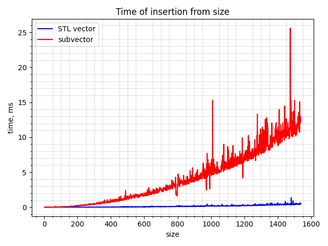
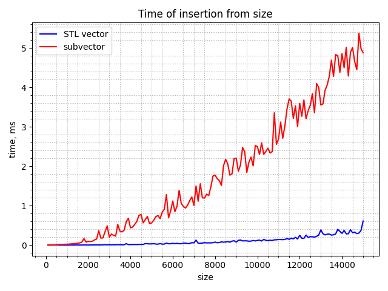
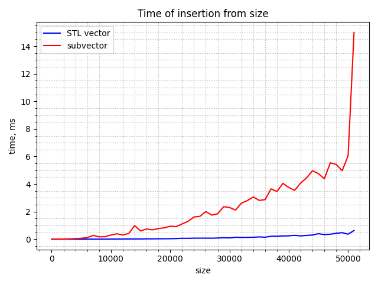

Из графика видно, что для стандартного вектора асмптотика O(N) (угол наклона прямой больше 0, хорошо видно при приближении к max size). Для subvector время работы значительно увеличивается с ростом size по сравнению с std::vector. Асимптотика для subvector - O(N) (из кода и графика).

## 2. Среднее время удаления одного элемента из произвольного места вектора
Измерялось время работы erase из середины вектора для subvector и std::vector<int>. Размер вектора рассматривался от 100 до 10000 с шагом 100.
### График: среднее время удаления для vector и subvector от size
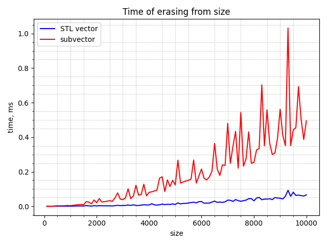

Асимптотика для std::vector - O(N), erase для subvector работает опять же гораздо медленнее, асимптотика для него из кода - O(N).

## 3. Среднее время добавления в начало односвязного списка
Измерялось время работы push_front, или push_forward, для subforwardlist, std::list и std::forward_list. Размер списков рассматривался от 100 до 10000 с шагом 100.
### График: среднее время работы push_front для list, forward_list и subforwardlist от size
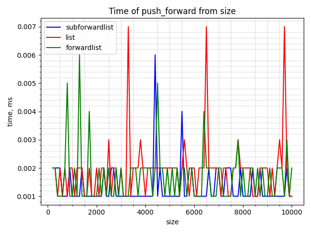

В данном случае, исходя из графика, асимптотика добавления в начало для всех исследуемых контейнеров - O(1).

## 4. Среднее время удаления из начала односвязного списка
Измерялось время работы pop_front, или pop_forward, для subforwardlist, std::list и std::forward_list. Размер списков рассматривался от 100 до 100000 с шагом 100.
### График: среднее время работы pop_front для list, forward_list и subforwardlist от size
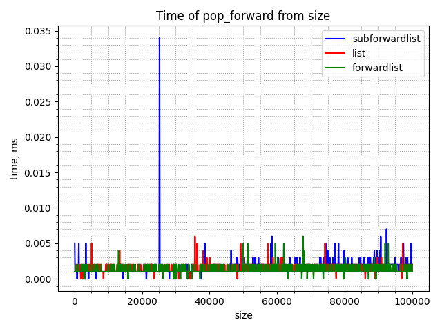

Опять же, исходя из графика, асимптотика удаления первого элемента для всех исследуемых контейнеров - O(1).

## 5. Среднее время добавления элемента в бинарное дерево
Измерялось время работы insert для subset, std::set, std::map, std::multiset и std::multimap. Размер деревьев рассматривался от 100 до 10000 с шагом 100.
### График: среднее время работы insert для set, map, multiset и multimap от size
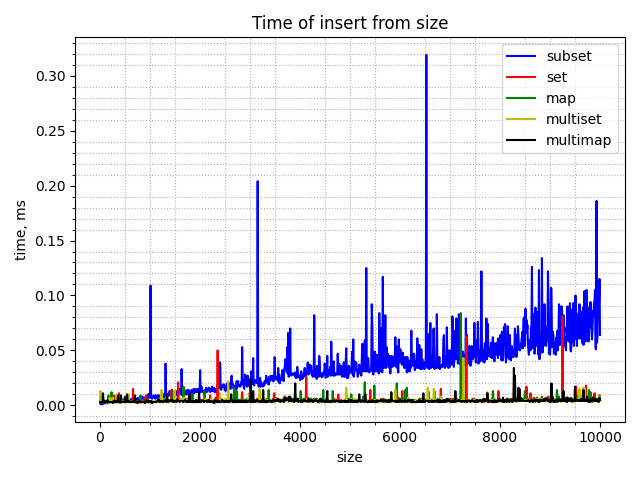

Из графика рукописный контейнер работает гораздо медленнее. Асимптотика добавления для стандартных контейнеров одна и та же - O(1)/O(log N). Для subset O(log N) из кода и графика.

## 6. Среднее время обхода всего контейнера
Измерялось время обхода для std::vector, std::list, std::forward_list, std::set и std::map. Размер контейнеров рассматривался от 100 до 100000 с шагом 100.
### График: среднее время обхода vector, forward_list, list, map, set от размера контейнера
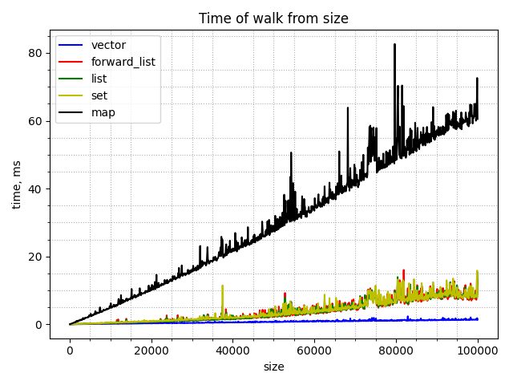

Из графика асимптотика обхода vector - O(1), list, forward_list, set, map - O(N), однако из последних четырёх контейнеров первые три примерно одинаково работают по времени, обход map работает гораздо дольше.

## 7. Среднее время доступа к произвольному элементу (random access) вектора
Измерялось время random access для subvector и std::vector. Размер контейнеров рассматривался от 100 до 99900 с шагом 100.
### График: среднее время обхода vector, forward_list, list, map, set от размера контейнера
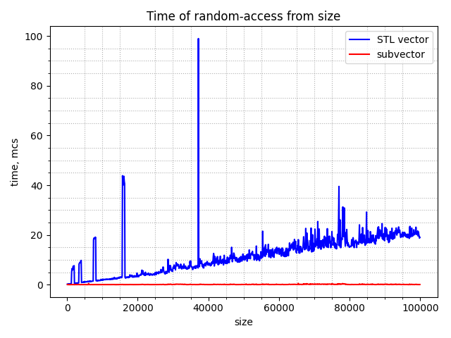

На данном графике в отличие от предыдущих время в микросекундах.
Из графика асимптотика random access для subvector - O(1), для std::vector - O(N) (возможно, тоже O(1), если учесть, что время крайне мало). Интересно, что в данном случае рукописный контейнер сработал быстрее. Это, вероятно, связано с тем, что в subvector поле mas - указатель на начало массива в куче, к его элементу по сути обращаемся как к элементу массива, а для массива асимптотика random access - O(1).

## Вывод:
Сравнил производительность рукописных и STL контейнеров. В списках очень быстро можно добавить элемент в начало и удалить из начала.
Деревья удобно использовать для вставки и удаления (ещё для поиска, но эта операция не исследовалась). У вектора достаточно быстрый доступ к произвольному элементу по индексу и быстрый обход. Рукописные контейнеры во многом работают медленнее (кроме random access для вектора), поэтому есть то, что можно модифицировать в них, однако по возможности лучше использовать готовые контейнеры, которые работают быстро и корректно, если уметь с ними обращаться.
